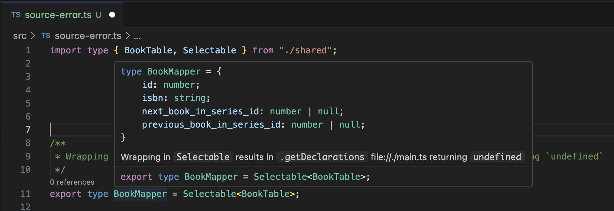

# typescript-type-get-declarations-bug

This is a reproduction repo to demonstrate when a property calls `.getDeclarations`, the declarations could be `undefined`.

## File Explanation

- `main.ts` is the program that uses TypeScript compiler and TypeChecker to find an alias type's properties type
- `shared.ts` contains complex generic types, generated by [kysely](https://kysely.dev/)
- `source-ok.ts` is a source which _does not_ use complex generic types on `BookMapper`. Property declarations are defined.
- `source-error.ts` is a source which uses complex generic types on `BookMapper`. Property declarations are undefined.

Note: VS Code is still able to work out the prop declarations of `BookMapper` in the error case:



## Commands

```shell
yarn test-ok # run the successful test where .getDeclarations() returns correct type declaration of a property
yarn test-error # run the error test where .getDeclarations() returns undefined
```
